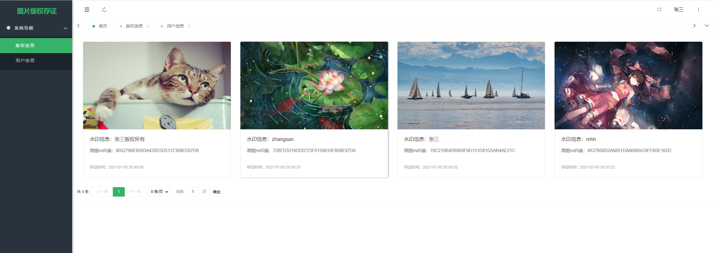
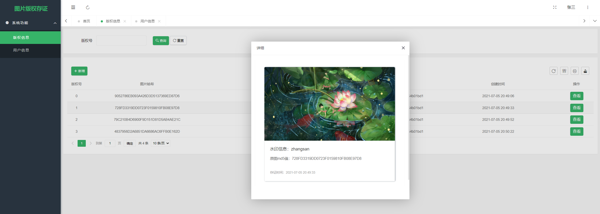
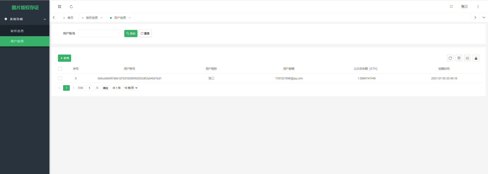
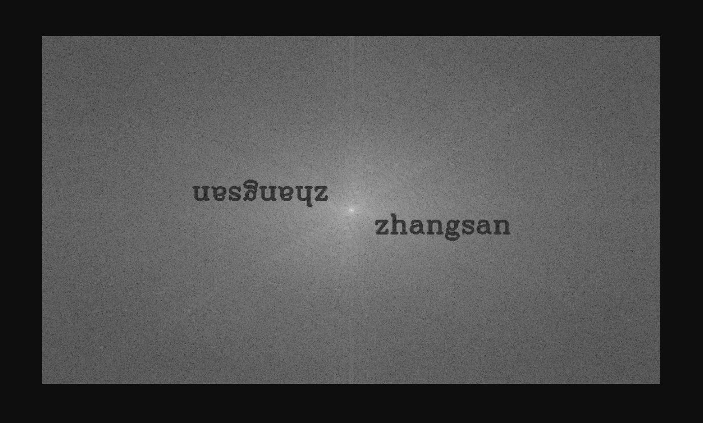

## 项目介绍

图片版存证系统基于盲水印技术以及区块链技术，**目的是给图片添加盲水印，同时将原图的哈希值存储上链，达到图片版权存证的功能**，项目采用 SpringBoot 以及Pear-Admin-Layui开发，涉及到了智能合约Solidity、打包、以及如何在Java中调用以太坊

* 项目预览：

## 项目技术

* SpringBoot
* Web3j
* Solidity
* OpenCV
* Pear-Admin-Layui

## 项目效果图

   

